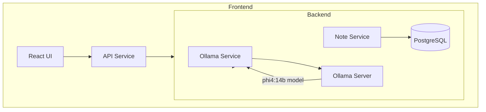

# Mukti: AI-Powered Study Notes Assistant 📚

Transform your learning experience with Mukti, an intelligent study assistant that generates personalized study notes using advanced AI technology. Built on Ollama's phi4:14b model, Mukti adapts content based on your unique learning style and proficiency level, making learning more effective and engaging.


## Features 🌟

Mukti transforms traditional studying through these powerful features:

### Personalized Learning Experience

Our assistant creates study materials perfectly matched to your needs by understanding your learning style and level of expertise. The system continuously adapts to provide the most effective learning experience for you.

### Intelligent Content Adaptation

The system supports multiple learning modalities:
- Visual learners receive diagram-rich content
- Auditory learners get conversation-style explanations
- Reading/writing preferences are met with structured text
- Kinesthetic learners receive interactive exercises

### Smart Organization

Navigate your study materials effortlessly with:
- Automatically generated tables of contents
- Hierarchical content structure
- Intelligent topic linking
- Quick search and retrieval

## Architecture 🏗️

Mukti employs a modern microservices architecture to deliver seamless learning experiences:



## Getting Started 🚀

### Prerequisites

Before running Mukti, ensure your system meets these requirements:

- Docker and Docker Compose (version 1.29.2 or higher)
- Access to an Ollama server with phi4:14b model installed
- Minimum 4GB RAM for optimal performance
- Stable internet connection for AI model access

### Installation

1. Clone the repository:
   ```bash
   git clone https://github.com/yourusername/mukti-study-assistant.git
   cd mukti-study-assistant
   ```

2. Configure your environment:
   ```bash
   # Copy configuration templates
   cp backend/.env.example backend/.env
   cp frontend/.env.example frontend/.env
   
   # Update configurations with your settings
   ```

3. Launch the application:
   ```bash
   docker-compose up --build
   ```

4. Access your installation:
   - Frontend Interface: http://localhost:3000
   - API Documentation: http://localhost:8000/docs

## Development Guide 💻

### Backend Development

```bash
cd backend
python -m venv venv
source venv/bin/activate  # Windows: venv\Scripts\activate
pip install -r requirements.txt
uvicorn app.main:app --reload --host 0.0.0.0 --port 8000
```

### Frontend Development

```bash
cd frontend
npm install
npm start
```

## Project Structure 📁

```
mukti-study-assistant/
├── backend/
│   ├── app/
│   │   ├── services/
│   │   │   ├── ollama_service.py
│   │   │   └── note_service.py
│   │   ├── main.py
│   │   ├── models.py
│   │   └── database.py
│   ├── requirements.txt
│   └── Dockerfile
├── frontend/
│   ├── src/
│   │   ├── components/
│   │   ├── services/
│   │   └── App.js
│   ├── package.json
│   └── Dockerfile
└── docker-compose.yml
```

## Contributing 🤝

We welcome contributions that make Mukti even better! Here's how to get involved:

1. Fork the repository
2. Create your feature branch: `git checkout -b feature/amazing-feature`
3. Commit your changes: `git commit -m 'Add amazing feature'`
4. Push to the branch: `git push origin feature/amazing-feature`
5. Open a Pull Request

Please review our CONTRIBUTING.md for detailed guidelines.

## Testing 🧪

Ensure code quality by running our comprehensive test suites:

```bash
# Backend tests
cd backend
pytest

# Frontend tests
cd frontend
npm test
```

## Environment Configuration 📋

Configure these essential environment variables:

```env
# Backend (.env)
OLLAMA_API_URL=your-ollama-server-url
OLLAMA_MODEL=phi4:14b
DATABASE_URL=postgresql://user:password@db:5432/notes

# Frontend (.env)
REACT_APP_API_URL=http://localhost:8000
```

## Roadmap 🗺️

Our vision for Mukti's future includes:

- Enhanced search functionality with natural language processing
- User authentication with personalized learning profiles
- Collaborative note sharing and study groups
- Cross-platform mobile application
- Offline study capabilities
- Integration with popular learning management systems

## License 📄

This project is licensed under the MIT License - see the [LICENSE](LICENSE) file for details.

## Acknowledgments 🙏

This project stands on the shoulders of giants:

- Built with FastAPI and React
- Powered by Ollama's phi4:14b model
- Styled with Tailwind CSS
- Supported by our amazing community of contributors

## Support 💬

Need assistance? We're here to help:

- Open an issue in our GitHub repository
- Join our Discord community
- Visit our comprehensive documentation

---

Made with ❤️ by the Mukti team
